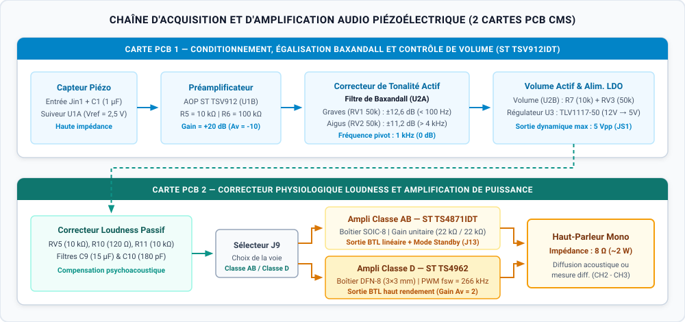
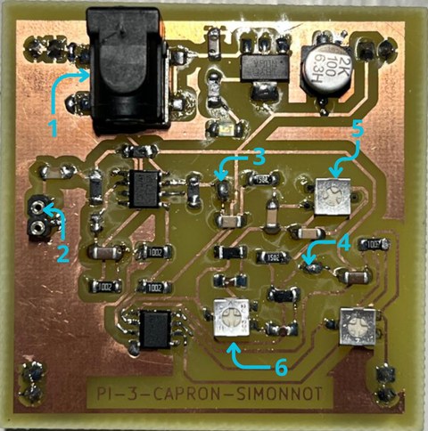
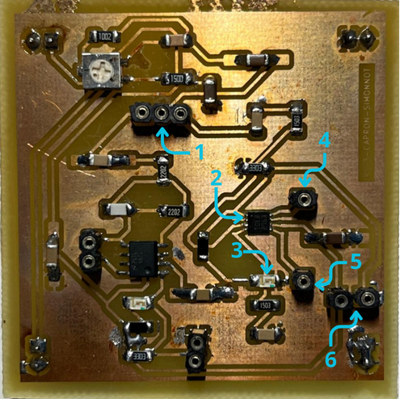
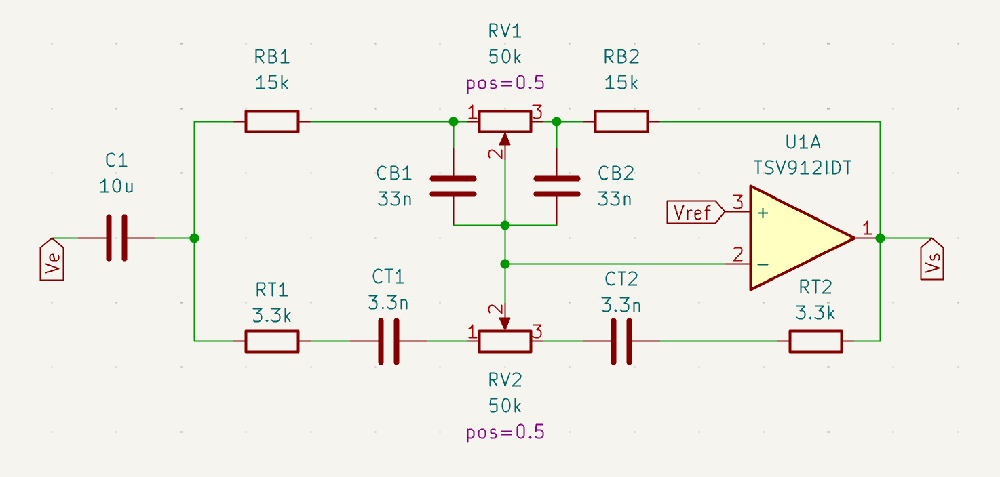
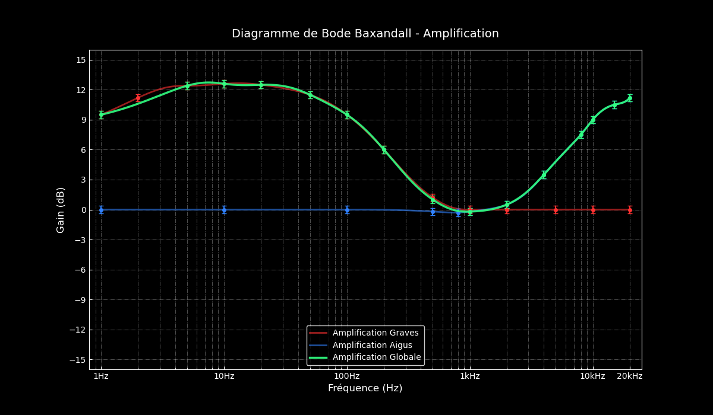
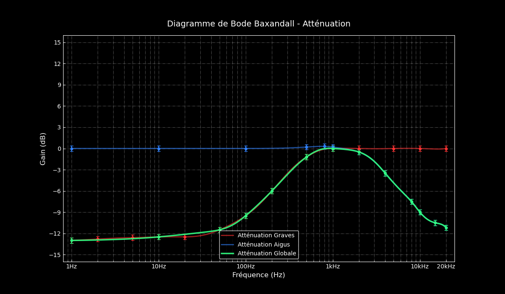
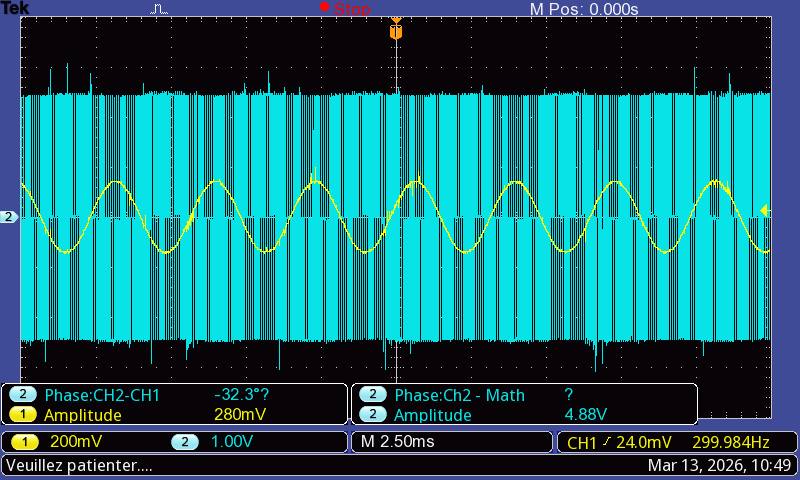
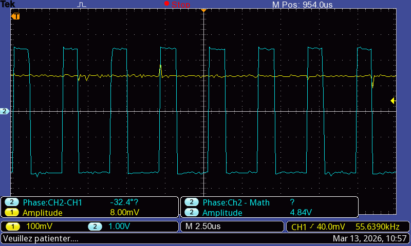
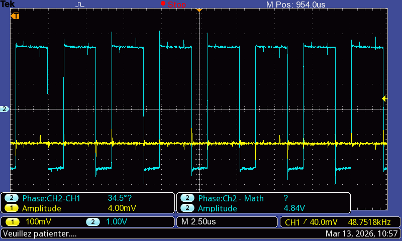

# Chaîne d'Amplification Audio Piézoélectrique & PCB CMS (KiCad 9)


Conception, simulation SPICE, routage PCB en composants montés en surface (CMS) et caractérisation expérimentale d'une chaîne complète de conditionnement et d'amplification audio pour capteur piézoélectrique (guitare acoustique, contrebasse). Le système est alimenté en asymétrique (0V/5V) et réparti sur deux cartes électroniques : une première dédiée à la préamplification et à l'égalisation active (filtre de Baxandall), et une seconde intégrant une correction physiologique (*Loudness*) ainsi que deux étages de puissance sélectionnables (Classe AB et Classe D) pour piloter un haut-parleur de 8 Ω (2 W).

* **[Consulter le rapport complet de caractérisation et fiches de mesures (PDF)](docs/characterization_report.pdf)**

---

## Sommaire
1. [Architecture globale et cartes PCB réalisées](#architecture-globale-et-cartes-pcb-réalisées)
2. [Structure du dépôt](#structure-du-dépôt)
3. [Conception électronique détaillée (Cartes 1 et 2)](#conception-électronique-détaillée-cartes-1-et-2)
4. [Caractérisation expérimentale et résultats](#caractérisation-expérimentale-et-résultats)
5. [Nomenclature des composants principaux (BOM)](#nomenclature-des-composants-principaux-bom)
6. [Ouverture des fichiers de conception (KiCad 9)](#ouverture-des-fichiers-de-conception-kicad-9)

---

## Architecture globale et cartes PCB réalisées



| Carte PCB 1 soudée (Préampli, Baxandall & Alim 5V) | Carte PCB 2 soudée (Loudness, Classe AB & Classe D) |
| :---: | :---: |
|  |  |
| *AOP ST TSV912IDT (SOIC-8), régulateur LDO 5V (SOT-223) et potentiomètres Vishay TS53YL* | *Ampli Classe AB TS4871 (SOIC-8), Ampli Classe D TS4962 (DFN-8) et cavalier de sélection* |

---

## Structure du dépôt

```text
kicad-piezo-audio-amplifier/
├── .gitignore
├── README.md
├── assets/
│   ├── audio_chain_architecture.svg  # Schéma synoptique vectoriel des 2 cartes PCB
│   ├── baxandall_bode_boost.png      # Diagramme de Bode expérimental (Modes Boost)
│   ├── baxandall_bode_cut.png        # Diagramme de Bode expérimental (Modes Cut)
│   ├── baxandall_schematic.png       # Schéma KiCad du filtre actif de Baxandall
│   ├── class_d_pwm_envelope.png      # Capture Tektronix : signal audio 300 Hz et enveloppe PWM
│   ├── class_d_pwm_zoom_neg.png      # Capture Tektronix : découpage PWM sur alternance négative
│   ├── class_d_pwm_zoom_pos.png      # Capture Tektronix : découpage PWM sur alternance positive
│   ├── pcb_part1_preamp.png          # Carte PCB 1 soudée en CMS
│   └── pcb_part2_power_amp.png       # Carte PCB 2 soudée en CMS
├── docs/
│   └── characterization_report.pdf   # Fiches de mesures complètes (Baxandall & Classe D)
└── hardware_kicad/
    ├── BE-Elec-S2.kicad_pro          # Fichier de projet KiCad 9.0
    ├── BE-Elec-S2.kicad_sch          # Schéma racine hiérarchique
    ├── Partie-1.kicad_sch            # Schéma Carte 1 (Préampli, Baxandall, Volume, Alim)
    ├── Partie-2.kicad_sch            # Schéma Carte 2 (Loudness, Ampli Classe AB & Classe D)
    └── BE-Elec-S2.kicad_pcb          # Routage PCB complet (empreintes CMS 1206, SOIC-8, DFN-8)
```

---

## Conception électronique détaillée (Cartes 1 et 2)

### 1. Carte PCB 1 : Alimentation, Préamplification et Égaliseur de Baxandall
La première carte assure l'adaptation d'impédance du disque piézoélectrique et la mise en forme spectrale du signal avec une excursion maximale de sortie de $5\text{ V}_{\text{pp}}$ :
* **Régulation 5V et masse virtuelle ($V_{\text{ref}} = 2,5\text{ V}$) :** Un régulateur LDO `TLV1117-50` (`LD1117`, boîtier SOT-223) abaisse la tension d'entrée 12V vers un rail régulé `VCC = 5V`. L'alimentation étant asymétrique (0V/5V), une polarisation à $V_{\text{ref}} = \text{VCC}/2 = 2,5\text{ V}$ est générée par ponts diviseurs (`R1`/`R2` de $100\text{ k}\Omega$ et `R3`/`R4` de $10\text{ k}\Omega$) pour centrer le signal audio et éviter tout écrêtage des alternances négatives.
* **Étage suiveur et préamplificateur (`U1` — ST `TSV912IDT`) :** Le signal issu du capteur piézoélectrique traverse un condensateur de couplage (`C1 = 1 µF`), passe par un amplificateur opérationnel monté en suiveur (`U1A`) offrant une haute impédance d'entrée, puis est amplifié par un montage inverseur (`U1B`, `R5 = 10 kΩ`, `R6 = 100 kΩ`) fixant un gain en tension de $\vert{}A_v\vert{} = R_6 / R_5 = 10$ (+20 dB).
* **Correcteur de tonalité actif de Baxandall (`U2A` — ST `TSV912IDT`) :** Réseau actif RC et potentiométrique permettant un réglage indépendant des graves et des aigus autour d'une fréquence charnière fixée à **1 kHz** :
  * **Voie Graves (Bass) :** Potentiomètre `RV1 = 50 kΩ`, résistances `RB1 = RB2 = 15 kΩ` et condensateurs `CB1 = CB2 = 33 nF`.
  * **Voie Aigus (Treble) :** Potentiomètre `RV2 = 50 kΩ`, résistances `RT1 = RT2 = 3,3 kΩ` et condensateurs `CT1 = CT2 = 3,3 nF`.



* **Contrôle de volume actif (`U2B` — ST `TSV912IDT`) :** Montage inverseur à gain variable (`R7 = 10 kΩ` en entrée et potentiomètre `RV3 = 50 kΩ` en contre-réaction) permettant d'ajuster le niveau injecté vers la carte de puissance.

### 2. Carte PCB 2 : Correcteur Loudness et Amplification Classe AB / Classe D
* **Correcteur physiologique (*Loudness*) :** Filtre passif RC associé au potentiomètre `RV5 = 10 kΩ` (`R10 = 120 Ω`, `R11 = 10 kΩ`, `C9 = 15 µF`, `C10 = 180 pF`) compensant la perte de sensibilité de l'oreille humaine aux extrémités du spectre sonore (basses et hautes fréquences) à faible volume d'écoute.
* **Amplificateur de puissance Classe AB (`U_AB1` — ST `TS4871IDT`) :** Amplificateur audio linéaire Rail-to-Rail 1 W en boîtier SOIC-8 configuré avec une résistance d'entrée `Rin1 = 22 kΩ` et une contre-réaction `Rfeed1 = 22 kΩ` (`Cfeed1 = 330 pF`).
* **Amplificateur de puissance Classe D (`U_D1` — ST `TS4962`) :** Amplificateur à découpage PWM sans filtre de sortie (*filter-free*) en boîtier miniature `DFN-8` ($3\times3\text{ mm}$). Avec une résistance de contre-réaction interne $R_f = 150\text{ k}\Omega$ et des composants d'entrée $R_8 = R_9 = 150\text{ k}\Omega$ et $C_{s2} = C_{s3} = 100\text{ nF}$, la fréquence de coupure basse et le gain différentiel théorique en topologie pontée (**BTL — Bridge-Tied Load**) valent :

$$f_c = \frac{1}{2\pi R_{\text{in}} C_{\text{in}}} = \frac{1}{2\pi \times 150\times 10^3 \times 100\times 10^{-9}} \approx 10,6\text{ Hz}$$

$$A_v = 2 \times \frac{R_f}{R_{\text{in}}} = 2 \times \frac{150\text{ k}\Omega}{150\text{ k}\Omega} = 2 \quad (+6,02\text{ dB})$$

---

## Caractérisation expérimentale et résultats

Les campagnes de validation ont été réalisées à l'aide d'un générateur de fonctions **GW Instek AFG-2112** et d'un oscilloscope numérique **Tektronix TBS 1052B-EDU**.

### 1. Réponse fréquentielle du filtre de Baxandall (1 Hz – 20 kHz)
Sept configurations des potentiomètres `RV1` (Graves) et `RV2` (Aigus) ont été caractérisées sur banc d'essai avec un signal sinusoïdal d'entrée $V_e = 100\text{ mV}$ :

| Configuration | Position Graves (`RV1`) | Position Aigus (`RV2`) | Gain Graves mesuré | Gain Aigus mesuré | Fréquence de coupure / pivot (-3 dB) |
|---|---|---|---|---|---|
| **1. Neutre (Suiveur)** | 50 % | 50 % | `0,0 dB` | `0,0 dB` | Réponse plate sur `[10 Hz – 20 kHz]` |
| **2. Bass Boost** | 100 % | 50 % | **`+12,6 dB`** | `0,0 dB` | $f_c \approx 100\text{ Hz}$ |
| **3. Treble Boost** | 50 % | 100 % | `0,0 dB` | **`+11,2 dB`** | $f_c \approx 4\text{ kHz}$ |
| **4. Dual Boost** | 100 % | 100 % | **`+12,6 dB`** | **`+11,2 dB`** | Fréquence charnière centrée à `1 kHz (0 dB)` |
| **5. Bass Cut** | 0 % | 50 % | **`-13,0 dB`** | `0,0 dB` | $f_c \approx 300\text{ Hz}$ |
| **6. Treble Cut** | 50 % | 0 % | `0,0 dB` | **`-11,2 dB`** | $f_c \approx 4\text{ kHz}$ |
| **7. Dual Cut** | 0 % | 0 % | **`-13,0 dB`** | **`-11,2 dB`** | Sommet résiduel à `1 kHz (~0 dB)` |

| Réponse fréquentielle en amplification (Boost) | Réponse fréquentielle en atténuation (Cut) |
| :---: | :---: |
|  |  |

### 2. Caractérisation PWM et mesure différentielle BTL de l'amplificateur Classe D (`TS4962`)
La sortie de l'amplificateur `TS4962` étant pontée (BTL), aucune des deux bornes `OUT+` et `OUT-` ne doit être reliée à la masse de l'oscilloscope sous peine de court-circuiter un demi-pont. La caractérisation a donc été effectuée en mode mathématique différentiel (**`CH2 - CH3`**) avec un signal test à $300\text{ Hz}$ :

| Grandeur caractérisée | Valeur théorique | Valeur expérimentale | Incertitude | Unité |
|---|---|---|---|---|
| Tension d'entrée crête-à-crête ($V_{\text{in}}$) | `280` | **`280`** | $\pm 0,1$ | mV |
| Tension de sortie différentielle BTL ($V_{\text{out}}$) | `560` | **`548`** | $\pm 20$ | mV |
| Gain en tension mesuré ($A_v = V_{\text{out}} / V_{\text{in}}$) | `2,00` | **`1,96`** | $\pm 0,15$ | — |
| Amplitude des créneaux de découpage ($V_{\text{pwm}}$) | `5,00` | **`4,88`** | $\pm 0,10$ | V |
| Fréquence de découpage PWM ($f_{\text{sw}}$) | `250 – 300` | **`266`** | $\pm 15$ | kHz |
| Rapport cyclique au repos ($DC_{\text{repos}}$) | `50,0` | **`50,4`** | $\pm 2,0$ | % |
| Excursion du rapport cyclique ($DC_{\text{min}}$ / $DC_{\text{max}}$) | `< 50` / `> 50` | **`40` / `60`** | $\pm 2,0$ | % |

| Enveloppe PWM globale ($2,50\text{ ms/div}$) | Découpage PWM sur creux négatif ($2,50\ \mu\text{s/div}$) | Découpage PWM sur pic positif ($2,50\ \mu\text{s/div}$) |
| :---: | :---: | :---: |
|  |  |  |
| *Entrée sinusoïdale 300 Hz ($280\text{ mV}_{\text{pp}}$) et découpage BTL* | *Rapport cyclique réduit ($DC_{\text{min}} \approx 40\ \%$)* | *Rapport cyclique élargi ($DC_{\text{max}} \approx 60\ \%$)* |

---

## Nomenclature des composants principaux (BOM)

| Référence | Composant | Fabricant | Boîtier CMS | Fonction |
|---|---|---|---|---|
| **`U1`, `U2`** | `TSV912IDT` | STMicroelectronics | `SOIC-8` | Doubles AOP Rail-to-Rail 8 MHz (Suiveur, Préampli, Baxandall, Volume) |
| **`U_AB1`** | `TS4871IDT` | STMicroelectronics | `SOIC-8` | Amplificateur de puissance audio Classe AB (1 W, BTL, Standby) |
| **`U_D1`** | `TS4962` | STMicroelectronics | `DFN-8` ($3\times3\text{ mm}$) | Amplificateur de puissance audio Classe D sans filtre (2,8 W, PWM 266 kHz) |
| **`U3`** | `TLV1117-50` / `LD1117` | ST / Texas Instruments | `SOT-223` | Régulateur linéaire LDO fixe 5,0 V (800 mA) |
| **`RV1`–`RV3`, `RV5`** | `TS53YL` (50 kΩ / 10 kΩ) | Vishay | CMS Vertical | Potentiomètres cermet (Graves, Aigus, Volume, Loudness) |
| **Passifs `R` / `C`** | Série E6 (`1206`) | Divers | `1206` (3216 Metric) | Résistances, condensateurs céramiques et électrolytiques CMS ($6,3\times5,2\text{ mm}$) |

---

## Ouverture des fichiers de conception (KiCad 9)

1. Installer **KiCad 9.0** (ou version ultérieure).
2. Ouvrir le projet `hardware_kicad/BE-Elec-S2.kicad_pro`.
3. Naviguer dans les deux sous-feuilles hiérarchiques `Partie-1.kicad_sch` et `Partie-2.kicad_sch` depuis l'éditeur de schémas (`eeschema`), ou ouvrir `BE-Elec-S2.kicad_pcb` dans l'éditeur de circuit imprimé (`pcbnew`).

---

## Auteurs

Projet réalisé en binôme par **Aurélien Capron** et **Amaury Simonnot** au sein de **Grenoble INP - Phelma** (Filière Systèmes Électroniques Intégrés / Tronc commun 1A).